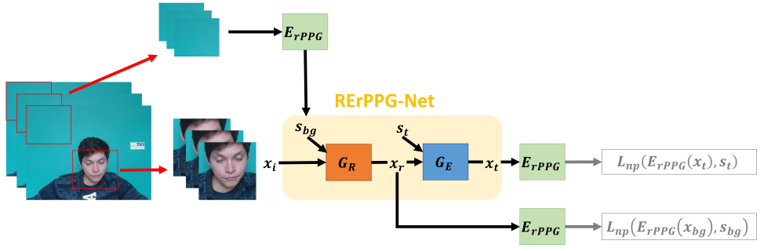

# Augmentation of rPPG Benchmark Datasets: Learning to Remove and Embed rPPG Signals via Double Cycle Consistent Learning from Unpaired Facial Videos

This repository is the official implementation of *Augmentation of rPPG Benchmark Datasets: Learning to Remove and Embed rPPG Signals via Double Cycle Consistent Learning from Unpaired Facial Videos* that has been accepted to ECCV 2022.

## Description

We propose a RErPPG-Net to augment existing rPPG datasets by embedding ground-truth PPG signals into any existing facial videos.

The proposed RErPPG-Net consists of a Removal-Net $G_{R}$ and an Embedding-Net $G_{E}$ and aims to remove any inherent rPPG signals existing in the input videos and then to embed the specified PPG signals into the rPPG-removed videos.

## Implementation

The RErPPG-Net and the rPPG estimator were trained with Nvidia RTX 2080 and RTX 3080.

## Training

The RErPPG-Net / rPPG estimator were trained with 900 / 500 epochs.

Optimizer : Adam optimizer with the learning rate of 0.001.

Batch size : RErPPG-Net / rPPG estimator were trained with 1 / 3 batch size.

## Dataset

For the Aug-rPPG database, please refer to [this link](https://github.com/nthumplab/RErPPGNet).

## Contributing

If you find this work useful, consider citing our work using the following bibTex:
